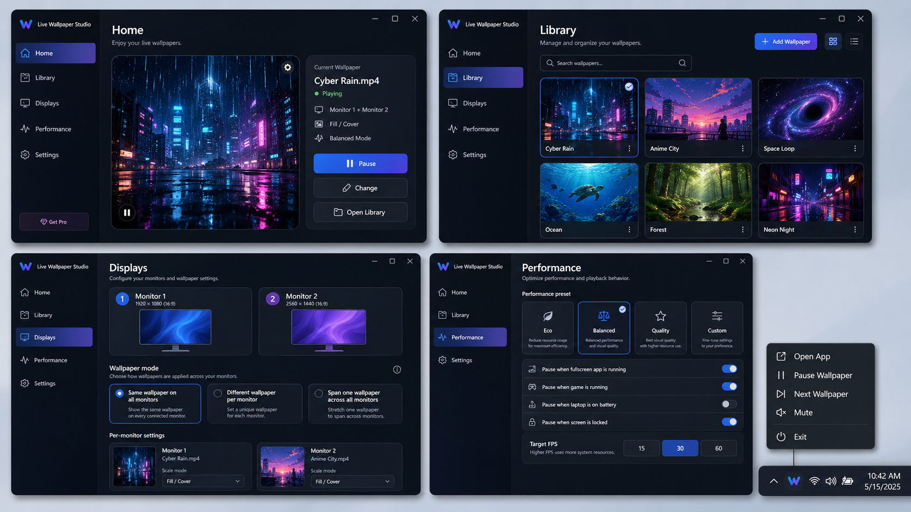

# Live Wallpaper Studio — Documentation Package

ชุดเอกสารนี้รวบรวมการวิเคราะห์และออกแบบโปรแกรม **Live Wallpaper Studio** จากบทสนทนา โดยแยกเป็นไฟล์ Markdown หลายส่วน พร้อมรูป mockup ที่ออกแบบไว้ 2 รูปในโฟลเดอร์ `img/`

## โครงสร้างไฟล์

```text
live-wallpaper-studio-docs/
├─ README.md
├─ requirements.md
├─ docs/
│  ├─ 01-product-overview.md
│  ├─ 02-feature-analysis.md
│  ├─ 03-technical-architecture.md
│  ├─ 04-wallpaper-engine-desktop-embedding.md
│  ├─ 05-ui-design-spec.md
│  ├─ 06-installer-uninstaller.md
│  ├─ 07-build-release-stack.md
│  ├─ 08-mvp-roadmap.md
│  ├─ 09-acceptance-criteria.md
│  └─ 10-references.md
└─ img/
   ├─ 01-main-app-ui-mockup.png
   └─ 02-install-uninstall-ui-mockup.png
```

## รูป mockup

### Main App UI



### Install / Uninstall UI


## Stack ที่แนะนำ

```text
Main App UI       : C# + .NET + WPF
Wallpaper Engine  : C# + Win32 API
Video Renderer    : libVLC / mpv / Media Foundation
Web Wallpaper     : WebView2
Database          : SQLite
Config            : JSON
Build             : dotnet publish
Installer         : Inno Setup
Custom Installer  : WPF Setup UI, ทำทีหลังได้
```

## แนวคิดหลัก

โปรแกรมควรแยกเป็น 2 ส่วนชัดเจน:

```text
Main App Window
- หน้าจอควบคุม
- ใช้เลือก wallpaper
- ตั้งค่า monitor
- ตั้งค่า performance
- เปิด/ปิด/ซ่อนลง system tray ได้

Wallpaper Renderer Window
- หน้าต่างพิเศษสำหรับแสดง wallpaper
- ไม่มี title bar
- ไม่มี border
- ไม่อยู่ taskbar
- ไม่โผล่ Alt+Tab
- ฝังไว้หลัง desktop icons
```

เป้าหมายของ MVP คือทำให้ผู้ใช้สามารถเพิ่ม wallpaper, ตั้ง MP4/ภาพนิ่งเป็น wallpaper, รองรับหลายจอ, ไม่บัง desktop icons, resize เต็มจอถูกต้อง, pause/resume ได้ และติดตั้งผ่าน `Setup.exe` ได้
