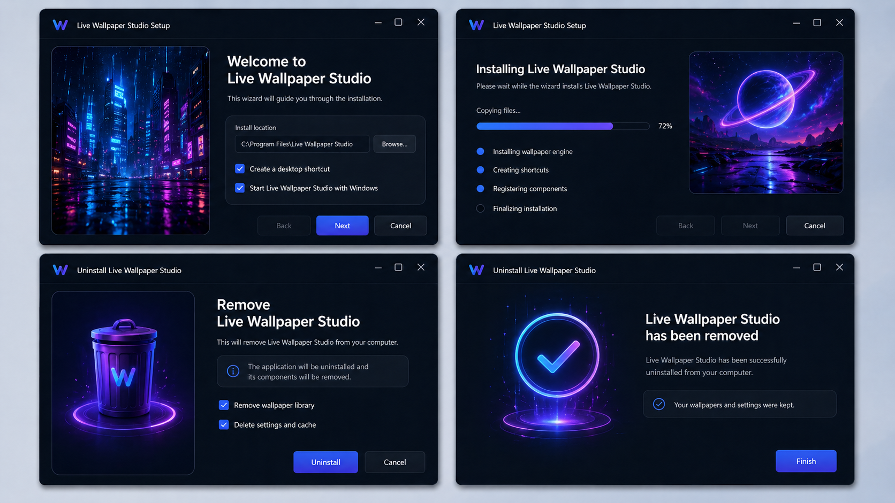

# Installer & Uninstaller Design

## รูป mockup



## แนวคิด

ตัวติดตั้งควรมี 2 ระดับ:

```text
Version แรก:
- ใช้ WPF Setup UI
- ได้ Setup.exe และ Uninstaller เร็ว

Version สวยเหมือน mockup:
- ใช้ WPF Custom Setup UI
- ด้านในใช้ installer core ของ WPF installer
```

## Installer Flow

```text
Welcome
↓
Install Options
↓
Installing Progress
↓
Finish
```

### Screen 1: Welcome / Install Options

ควรมี:

```text
- Logo / App name
- ภาพ preview สวย ๆ
- Install location
- Browse button
- Create desktop shortcut checkbox
- Start with Windows checkbox
- Back / Next / Cancel
```

### Screen 2: Installing Progress

ควรมี:

```text
- Progress bar
- Percent
- Current task เช่น Copying files...
- Step list:
  - Installing wallpaper engine
  - Creating shortcuts
  - Registering components
  - Finalizing installation
- Back disabled
- Next disabled
- Cancel
```

### Screen 3: Finish

ควรมี:

```text
- Success state
- Launch app after install checkbox
- Finish button
```

## Uninstaller Flow

```text
Confirm Remove
↓
Uninstalling
↓
Complete
```

### Screen 1: Remove Live Wallpaper Studio

ควรมี:

```text
- ข้อความแจ้งว่าจะลบโปรแกรม
- Checkbox:
  - Remove wallpaper library
  - Delete settings and cache
- Uninstall button
- Cancel button
```

ค่า default ที่แนะนำ:

```text
Keep user wallpapers: default yes
Keep settings: default yes
Delete cache: default yes
```

เพราะ wallpaper ของผู้ใช้อาจเป็นไฟล์ส่วนตัว ไม่ควรลบโดยไม่ตั้งใจ

### Screen 2: Uninstall Complete

ควรมี:

```text
- Success checkmark
- ข้อความว่า app ถูกลบแล้ว
- แจ้งว่า wallpapers/settings ถูกเก็บไว้หรือถูกลบ
- Finish button
```

## Installer Tool ที่แนะนำ

```text
WPF Setup UI
```

เหมาะกับ:

```text
- สร้าง Setup.exe
- copy files ไป Program Files
- สร้าง Desktop shortcut
- สร้าง Start Menu shortcut
- เขียน uninstall entry
- ทำ Uninstaller
- ตั้ง startup entry
- จัดการ upgrade version เก่า
```

## Custom Installer UI

ถ้าต้องการหน้าตาแบบ mockup 100%:

```text
WPF Custom Setup Launcher
↓
แสดง UI สวย ๆ
↓
เรียก installer core ของ WPF installer
↓
แสดง progress
↓
Finish
```

ข้อดี:

```text
- สวยตาม branding
- คุม theme/animation/layout ได้
- UX ดู premium
```

ข้อเสีย:

```text
- งานเพิ่ม
- ต้องจัดการ permission
- ต้อง handle error เอง
- อาจยุ่งกว่า installer มาตรฐาน
```

## Installer Requirements

| ID | Requirement | Priority |
|---|---|---|
| INS-01 | เลือก install location ได้ | P0 |
| INS-02 | Create desktop shortcut checkbox | P0 |
| INS-03 | Start with Windows checkbox | P0 |
| INS-04 | แสดง install progress | P0 |
| INS-05 | Cancel installation ได้ | P0 |
| INS-06 | Launch app after install checkbox | P1 |
| INS-07 | Custom dark UI แบบ mockup | P2 |

## Uninstaller Requirements

| ID | Requirement | Priority |
|---|---|---|
| UNI-01 | ปิด running app ก่อน uninstall | P0 |
| UNI-02 | หยุด wallpaper renderer ก่อน uninstall | P0 |
| UNI-03 | ลบ app files | P0 |
| UNI-04 | ลบ desktop shortcut | P0 |
| UNI-05 | ลบ Start Menu shortcut | P0 |
| UNI-06 | ลบ startup entry | P0 |
| UNI-07 | ให้เลือกว่าจะเก็บ settings ไว้ไหม | P1 |
| UNI-08 | ให้เลือกว่าจะลบ wallpaper library ไหม | P1 |
| UNI-09 | แสดง uninstall complete screen | P1 |
| UNI-10 | Custom uninstall UI แบบ mockup | P2 |

## สิ่งที่ต้องระวังตอน uninstall

```text
- ถ้า app ยังรันอยู่ ต้องปิดหรือแจ้งผู้ใช้
- ต้องหยุด wallpaper renderer ก่อนลบไฟล์
- ต้องลบ startup entry
- ต้องไม่ลบไฟล์ wallpaper ส่วนตัวโดยไม่ตั้งใจ
- ต้องไม่ทิ้ง process/window ค้าง
- ต้องไม่ทิ้ง shortcut หรือ registry entry ที่ไม่จำเป็น
```
